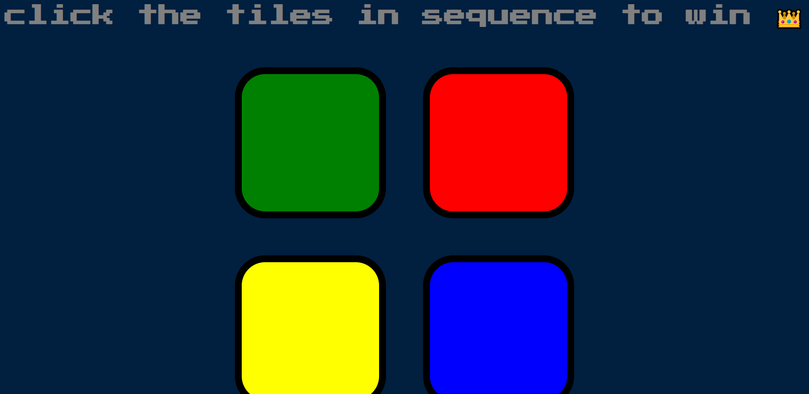
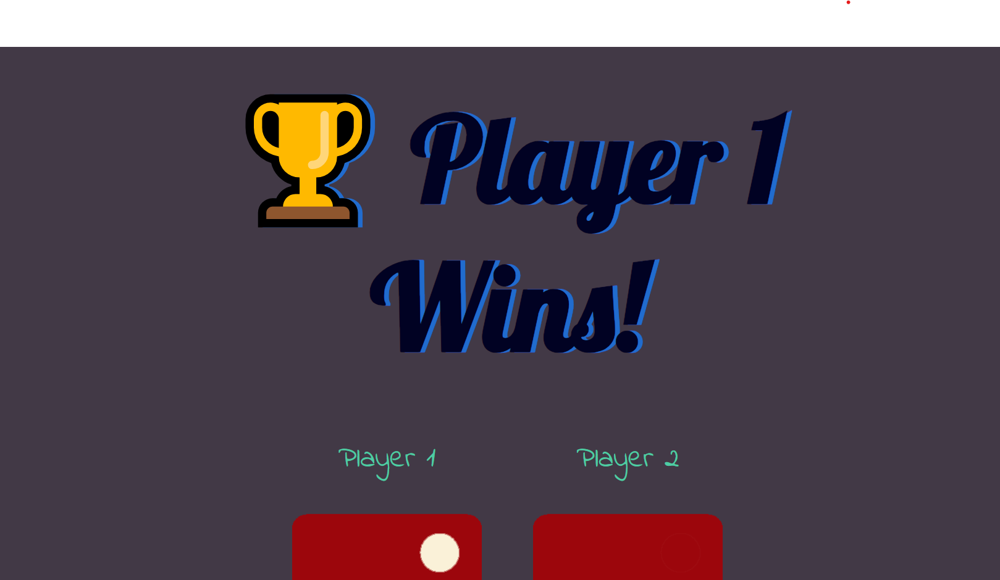

# Welcome to My Portfolio

## Introduction

I am Akash Rajput, a dedicated and multifaceted individual currently pursuing a B.Tech degree in Artificial Intelligence and Machine Learning at AKGEC in Agra. 
Currently in my second year of studies, I have been delving into the exciting world of AIML while simultaneously developing my skills as a frontend web developer and exploring the intricacies of backend development. 
I am also fortunate to be a trainee at the Software Incubator in AKGEC, where I am continuously learning and growing in a dynamic tech environment.
## Skills:
- I possess a strong foundation in programming languages, including C, C++, JavaScript, and proficiency in web development with HTML and CSS. 
These skills empower me to create dynamic and user-friendly websites and applications.
## Technical Skills

### Web Development

- *Frontend:*
  - HTML
  - CSS
  - JavaScript
- *Backend:*
  - Node.js
  - Express.js

### Version Control

- Git
### Languages

- *JavaScript*
- *C*
- *C++*
- *CSS*
- *HTML*
## My Projects
### Project 1: Simpson Game

- *Description:* A simple and effective game for testing memory power.
- *Project Link:* [Simpson Game](https://github.com/akash85246/simson-game)
- *GitHub Repository:* [Simpson Game Repo](https://akash85246.github.io/simson-game/)
### Project 2: Dice Game

- *Description:* This is a cool project that I contributed to. It has some great features.
- *Project Link:* [Dice Game](https://akash85246.github.io/Dice-game/)
- *GitHub Repository:* [Dice Game Repo](https://github.com/akash85246/Dice-game)

## Personal Information

Hello, I'm Akash L Rajput, a dedicated and enthusiastic Devloper with a passion for technology and a commitment to personal and professional growth. Here's a bit about me:

- *Full Name:* Akash Lodhi Rajput
- *Date of Birth:* October 22, 2003
- *Hometown:* Ghaziabad, India
- *Current Location:* Ghaziabad, India
## Hobbies:
1. **Flute Learning:** 
My passion for music led me to embark on a month-long journey of learning to play the flute, guided by the skilled Swara Saurav. 
The enchanting melodies and rhythms of this instrument have not only become a hobby but also a form of creative expression in my life.

2. **Drawing:**
 Drawing is more than just a hobby for me; it's a canvas for my thoughts, emotions, and imagination. 
Each stroke of the pencil or brush allows me to channel my creativity onto paper, creating a world of visual storytelling.

3. **Basketball:** In my 10th grade, I was actively involved in playing basketball. 
The fast-paced nature of the game, the teamwork, and the thrill of scoring points on the court left an indelible mark on me, emphasizing the importance of dedication and collaboration.

4. **Horror Movies and Haunted Places:** 
I have a fascination with horror movies and a love for visiting haunted places. 
The suspense, scares, and adrenaline rushes from these experiences intrigue me. 
My dream destination is Bhangarh, known for its paranormal history.

5. **Cooking Maggi:**
 As a fun fact, I take pride in my ability to cook a perfect bowl of Maggi. 
It's a quick and delicious snack that I enjoy preparing and sharing with friends and family.

## My Strengths
- Multitasking is a key strength of mine, allowing me to efficiently manage complex projects and meet deadlines with precision.

- My ability to understand and adapt to various situations enhances my problem-solving and decision-making capabilities, making me a versatile asset in both technical and non-technical scenarios.
## Unique Qualities
 In summary,I am a motivated individual with a passion for technology, a flair for creativity, and a diverse range of interests that enrich my life. 
 My skills and experiences reflect my commitment to personal and professional growth, and I eagerly anticipate the opportunities that lie ahead in my academic and professional journey.
 ## Call to Action

I'm always open to new opportunities and collaborations. If you have an interesting project or opportunity you'd like to discuss, please don't hesitate to get in touch with me:

- *Email:* akash22164033@akgec.ac.in
- *LinkedIn:* [Akash on LinkedIn](https://www.linkedin.com/in/akash-l-rajput-848b0327a/)
- *GitHub:* [Akash on GitHub](https://github.com/akash85246)